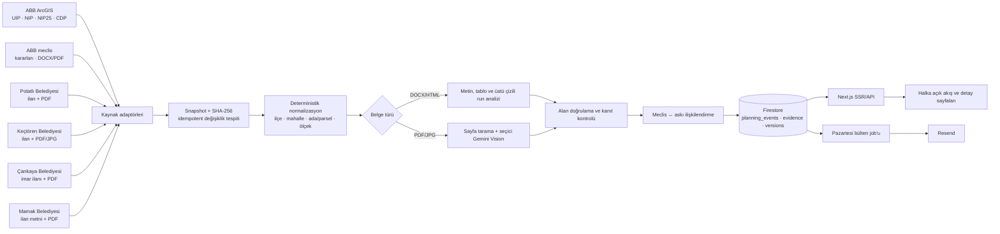
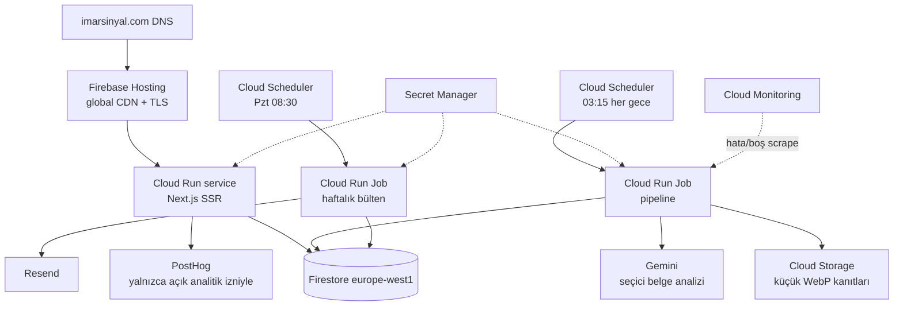

# İmarSinyal Ankara

ABB meclis kararlarını, büyükşehir askı katmanlarını ve ilçe belediyesi
ilanlarını otomatik izleyen; kaynak belgeli, filtrelenebilir planlama
değişikliği akışı.

Bu repository üç parçadan oluşur:

- `apps/web`: Next.js 15.5.21, TypeScript, SSR web ürünü ve HTTP API'leri
- `services/pipeline`: Python scraper, belge analizi, ilişkilendirme ve bülten
- `infra`: Firebase, Firestore, Cloud Run, Scheduler ve izleme yapılandırması

İlk sürümde hesap, ödeme, kişisel takip listesi ve harita yoktur. Yerelde
korunan 11 doğrulanmış fixture ile ürün hemen açılır; bulutta veri Firestore'dan
okunur.

## Çalışan ürün

Sayfalar:

- `/`: ürün anlatımı, öne çıkan olaylar ve bülten formu
- `/degisiklikler`: ilçe, aşama, kategori, metin ve etki filtresi
- `/degisiklik/[slug]`: eski/yeni alanlar, süreç, kanıt ve resmî belgeler
- `/bulten`: açık rıza ve en fazla üç ilçe tercihi
- `/gizlilik`, `/kullanim-kosullari`

API:

- `GET /api/events`
- `GET /api/events/{slug}`
- `POST /api/subscribers`
- `GET|POST /api/unsubscribe`
- `GET /api/healthz` (canlı Cloud Run/Firebase sağlık kontrolü)
- `GET /healthz` (yerel uygulama rotası; Google Frontend bu yolu rezerve eder)
- `GET /healthz.json` (Firebase edge sağlık kontrolü)

Tarayıcı Firestore'a doğrudan erişmez. Okuma ve yazma Next.js sunucusu
üzerindendir; Firestore güvenlik kuralları istemci erişimini kapatır.

Tarih alanları tarayıcı dilinden bağımsız Türkçe takvim kullanır. İsteğe bağlı
PostHog entegrasyonu varsayılan olarak kapalıdır; kullanıcı analitik izni
vermeden olay göndermez, oturum kaydı ve form içeriği toplamaz.

## Bugünkü aşama

Ürün **özel beta / yumuşak lansman hazırlığı** aşamasındadır. Altyapı ve halka
açık ürün dilimleri tamamlanmış, gerçek kullanıcı edinimi henüz
başlatılmamıştır.

| İlk 12 haftalık plan | Durum | Açıklama |
|---|---|---|
| Hafta 1 — temel ve landing | Tamamlandı | Next.js, Firestore, Cloud Run ve bülten formu canlı |
| Hafta 2 — ABB meclis scraper | Tamamlandı | 1 Ocak 2026 backfill ve idempotent snapshot akışı var |
| Hafta 3 — halka açık olay sayfaları | Tamamlandı | Akış, filtre, detay, kaynak ve SEO rotaları canlı |
| Hafta 4 — sınıflandırma ve etki | Tamamlandı | Deterministik kategori/etki ve kanıt korumaları var |
| Hafta 5 — harita | Bilinçli ertelendi | MVP kapsamı dışında |
| Hafta 6 — hesap/takip listesi | Bilinçli ertelendi | MVP kapsamı dışında |
| Hafta 7 — e-posta | Teknik olarak tamamlandı, kontrollü kapalı | Resend domain/segment, kayıt-unsubscribe ve pazartesi test gönderimi çalışıyor; toplu gönderim lansman kararını bekliyor |
| Hafta 8 — ödeme | Başlamadı | Kullanım sinyali görülmeden açılmayacak |
| Hafta 9 — bülten lansmanı | Hazır, yayın bekliyor | Pazartesi 08:30 job'u kurulu |
| Hafta 10 — doğrudan erişim | Başlamadı | Domain ve ilk kaynak kalite kontrolünden sonra |
| Hafta 11 — ücretli dönüşüm | Başlamadı | En erken kullanım davranışı oluştuktan sonra |
| Hafta 12 — go/no-go | Başlamadı | Abone, geri dönüş ve talep metrikleriyle yapılacak |

Kronolojik olarak “7. haftadayız” demek yanıltıcı olur: 5. hafta haritası
ertelendi, 6. haftadaki kişisel takip henüz yapılmadı; 7 ve 9. haftanın
altyapısı ise öne alındı. Doğru ürün tanımı **Hafta 4 tamamlandı + e-posta
altyapısı hazır + kaynak kapsaması/lansman kalite kapısı** şeklindedir.

## Sistem akışı

### Veri ve yayın hattı



### Bulut mimarisi



- UIP, NIP, NIP25, CDP, Polatlı, Keçiören, Çankaya ve Mamak kaynakları
  bağımsız çekilir; bir kaynağın hatası diğerlerini durdurmaz.
- Geometri WGS84 olarak alınır; bbox ve centroid saklanır.
- Yeni, değişmiş, aynı kalan ve kaynaktan düşen snapshot'lar ayrılır.
- Meclis kararları 1 Ocak 2026'ya kadar geriye doldurulabilir.
- Polatlı ilan metni ve bağlı PDF; Keçiören ilan metni ve bağlı PDF/JPG birlikte
  saklanır. Çankaya'da yalnızca **İmar İlanları** tablosu alınır; bitişikteki
  Yapı Kontrol ilanları dışarıda bırakılır. Aynı dosyaya giden İndir/Görüntüle
  bağlantıları tek belge sayılır ve PDF'deki askı/karar metadatası deterministik
  okunur. Mamak'ta ilan sayfasındaki metin, kesin askı tarihleri ve bağlı durum
  haritası birlikte alınır. Mamak'ın eski dosya sunucusu erişilemez olsa bile
  resmî HTML metni ana kanıt olarak işlenir ve gece job'ı bekletilmez.
- DOCX metni, tabloları ve üstü çizili run'ları deterministik okunur.
- PDF'nin tüm sayfaları ucuz metin/çizim taramasından geçer; en ilgili en fazla
  12 sayfa Vision'a gider.
- Varsayılan model `gemini-3.5-flash-lite`, belirsizlik/hata durumunda
  `gemini-3.6-flash` kullanılır. `temperature` gönderilmez.
- Emsal, TAKS, Yençok ve kişi/ha yoğunluğu ayrı alanlardır.
- Kaynaktaki kanıta bağlanamayan eski/yeni değer temizlenir ve yayımlanmaz.
- Meclis ve askı olayları ilçe, parsel, ölçek ve tarih yakınlığıyla bağlanır.
  Düşük güvenli adaylar birleştirilmez.
- Haftalık bülten, resmî tarihi son yedi günde olan olaylarla kaynak içeriği
  son yedi günde ilk kez görülen/değişen olayların birleşimini alır. Aynı olay
  iki kurala da uyarsa yalnızca bir kez gönderilir. `newsletter --dry-run`
  seçilen olayları e-posta göndermeden gösterir.
- Kaynak PDF'lerin tamamı Storage'a kopyalanmaz; URL, hash ve küçük WebP kanıt
  önizlemeleri saklanır.

### Kaynak kapsamı ve yenileme sıklığı

Üretimde kaynaklar kullanıcı sayfa açtığında çekilmez. Cloud Scheduler her gece
`03:15 Europe/Istanbul` saatinde tek bir snapshot çalışması başlatır. İhtiyaç
halinde aynı Cloud Run Job elle de çalıştırılabilir.

| Kaynak | Üretimde | İçerik | Geometri |
|---|---|---|---|
| ABB UIP | Evet | Aktif 1/1000 askılar | Resmî plan sınırı |
| ABB NIP | Evet | Aktif 1/5000 askılar | Resmî plan sınırı |
| ABB NIP25 | Evet | Aktif 1/25000 askılar | Resmî plan sınırı |
| ABB CDP | Evet, hata izole | 1/100000 askılar | Kaynak servis dönerse sınır |
| ABB Meclis | Evet | 2026 kararları, DOCX/PDF | Yok |
| Polatlı | Evet | İlan metni ve PDF | Yok |
| Keçiören | Evet | İlan metni ve PDF/JPG | Yok |
| Çankaya | Evet | Yalnızca İmar İlanları ve PDF | Yok |
| Mamak | Evet | Askı metni, tarih ve ek belge | Yok |
| Altındağ genel duyuruları | Hayır | Çoğunlukla yapı/yıkım tebligatı | Yok |
| Etimesgut İmar Planları | İncelendi, beklemede | Tarihsiz askı yerine plan arşivi/paftası | Belge içi çizim |

Altındağ'ın genel duyuru akışı, başlığında “imar” veya “askı” geçse bile plan
değişikliğinden farklı olan 3194/39 yapı tebligatlarını içerir. Bu akış ayrı bir
ürün kategorisi oluşturulmadan alınmaz. Etimesgut sayfasında gerçek plan
paftaları ve plan notları bulunur; ancak kayıtlarda güvenilir askı başlangıç ve
bitiş tarihleri yoktur. Bu belgeler ileride `plan_archive` /
`source_published` aşaması eklendiğinde alınabilir; bugün `on_appeal` olarak
yayımlanmaz.

### Harita için önerilen iki aşama

İlk harita için PostGIS zorunlu değildir. ABB kayıtlarında kaynaktan gelen
WGS84 plan poligonu, bbox ve centroid zaten Firestore'da saklanmaktadır. Dar
MVP şu şekilde kurulabilir:

1. `GET /api/events/map` yalnızca tarih/ilçe/etki filtresine uyan olayları
   GeoJSON olarak döndürür.
2. MapLibre GL JS, ABB plan poligonlarını çizer.
3. Geometrisi olmayan ilçe ilanları ancak resmî olarak doğrulanmış bir
   centroid varsa nokta olarak; aksi halde yalnızca liste kartında gösterilir.
4. Her geometri `plan_polygon`, `parcel_polygon`, `centroid` veya `text_only`
   güven etiketi ve kaynak URL'si taşır.
5. 7/30/90 gün, ilçe, mahalle ve etki filtreleri API sorgusuyla uygulanır;
   harita nesnesine tıklanınca mevcut detay sayfası açılır.

PostGIS ikinci aşamada, kullanıcıların çizdiği alan ile plan sınırlarının
kesişmesi, mesafe tamponu ve büyük hacimli parsel eşleştirmesi gerektiğinde
eklenir. `ST_IsValid`, `ST_Intersects` ve `ST_DWithin` kontrolleri olmadan
“parsel kesin etkileniyor” denmez. Firestore ana ürün veritabanı kalabilir;
Cloud SQL/PostGIS yalnızca mekânsal indeks ve eşleştirme katmanı olur.

Parsel geometrisinde öncelik sırası:

1. Resmî belediye/ABB servisinde açıkça yayımlanan geometri
2. Kullanım ve yeniden yayınlama yetkisi doğrulanmış resmî TKGM/MEGSİS servisi
3. Aynı resmî belgede ada/parsel metin kanıtı
4. Yalnızca bölgesel sinyal

TKGM'nin halka açık Parsel Sorgu ekranı bir veri lisansı veya kararlı toplu API
olarak varsayılmaz. Servis yetkisi netleşmeden arka uç endpoint'i taklit
edilmez ve geometri topluca kopyalanmaz.

### Hesap ve takip listesi tasarımı

Hesap özelliği Firebase Authentication e-posta bağlantısı ile şifresiz
başlatılabilir. Tarayıcı Firestore'a doğrudan yazmaz; Next.js API, Firebase ID
token'ını doğrulayıp şu kayıtları sunucu tarafında yönetir:

```text
users
watchlists
watch_targets
event_matches
notification_preferences
alert_deliveries
```

İlk takip hedefleri `district`, `neighborhood`, `parcel`, `polygon` ve
`keyword` olur. Eşleştirme sırası:

1. İlçe ve mahalle: normalize edilmiş tam eşleşme
2. Ada/parsel: `il/ilçe/mahalle/ada/parsel` anahtarı ve belge kanıtı
3. Çizili alan: resmî plan poligonu ile mekânsal kesişim
4. Anahtar kelime: başlık, özet ve kanıt metninde eşleşme

Her eşleşme `exact`, `nearby`, `mentioned` veya `regional` güven sınıfı taşır.
Gece pipeline'ından sonra ayrı bir matcher çalışır; olay + takip kuralı + kanal
birleşimi idempotency anahtarı olduğu için aynı alarm iki kez gitmez. Kullanıcı
günlük/haftalık sıklık, sessiz saat ve ilçe tercihini değiştirebilir. Hesap
silme, veri dışa aktarma, e-posta doğrulama, rate limit ve kural üst sınırı
ilk sürümün parçasıdır.

## Yerel kurulum

Gereksinimler: Node.js 22+, pnpm ve Python 3.11+.

```bash
pnpm install
python3 -m venv .venv
source .venv/bin/activate
pip install -r services/pipeline/requirements.txt
```

Web:

```bash
pnpm dev
```

`http://localhost:3000` adresi Firestore değişkeni yokken 11 fixture olayıyla
açılır.

Pipeline:

```bash
cp services/pipeline/.env.example services/pipeline/.env
PYTHONPATH=services/pipeline python -m imarsinyal.cli nightly
```

Yerel varsayılan veri deposu `data/imarsinyal-local.db` SQLite dosyasıdır.
Gemini anahtarı boşsa kaynak kayıtları yine işlenir fakat eski/yeni alanları
`source_only` olarak boş bırakılır.

Testler:

```bash
pnpm test
pnpm lint
pnpm build
PYTHONPATH=services/pipeline python -m unittest discover -s services/pipeline/tests -v
bash -n infra/bootstrap-cloud.sh infra/configure-schedulers.sh infra/configure-alerts.sh
```

Regresyon paketi özellikle şunları kilitler:

- Yuva `121–250 kişi/ha` emsal değildir.
- Korkutreis `TAKS 0.60` emsal değildir.
- Beytepe UIP/NIP ayrı kayıt kalır ve ilişkilenir.
- Tek ArcGIS katman hatası diğer katmanları durdurmaz.
- Aynı snapshot ikinci çalışmada yeni yazım üretmez.

26 Temmuz 2026 canlı doğrulamasında UIP 1, NIP 5, NIP25 0, Polatlı 4,
Keçiören 6 ve 2026 kesimine uyan 51 meclis kaydı birlikte işlendi. Toplam 67
kaynak kaydının 10'u yeni snapshot olarak 10 ürüne dönüştü; başarısız kayıt
olmadı. CDP servis hatası izole edildi ve diğer kaynakları durdurmadı. Aynı
snapshot'ın ikinci çalışmasında `changed_snapshots=0`,
`unchanged_snapshots=67` elde edilerek idempotency canlıda doğrulandı.
Geçmiş veri kalite bakımında 197 olayın parsel alanı, 59 olayın aynı
eski/yeni metrikleri ve etki puanı sürümlü olarak düzeltildi; iki bakım
komutunun da ikinci geçişi sıfır değişiklik üretti.

26 Temmuz 2026'da eklenen ilçe adaptörlerinin salt-okunur canlı kontrolünde
Çankaya'dan 6 imar ilanı, Mamak'tan 1 güncel askı ilanı hatasız normalize
edildi. Kırkkonaklar 26374/5 kaydı Çankaya PDF'sindeki ABB 384 numaralı karar
ve askı tarihleriyle; Mamak 86230/1 NPP ilanı ise 198 gerçek ada/parsel,
1338/1482 numaralı ABB Encümen kararı ve kesin askı aralığıyla okundu.
`86230/1 NPP` gibi plan dosya numaralarının ada/parsel sanılması engellendi.

Aynı gün production job'ı 74 kaynak kaydı ve 23 aktif askı kaydıyla
tamamlandı (`failed_records=0`). Çankaya'nın 6 ve Mamak'ın 1 olayı canlı
API'ye yayımlandı. Kırkkonaklar 26374/5 ilçe askısı ABB Meclisinin 384
numaralı kararıyla `%90` güvenle ilişkilendirildi. Sürekli hata veren CDP
katmanı kısmi kaynak hatası olarak raporlandı; diğer 7 askı kaynağı ve meclis
akışı durmadı.

Eski kayıtların parsel alanlarını yeni deterministik kurallarla kontrol etmek
için bakım komutu önce salt-okunur çalıştırılır, örnekler incelendikten sonra
`--apply` ile yazılır. Yazılan her düzeltme `change_versions` koleksiyonunda
sürümlenir:

```bash
PYTHONPATH=services/pipeline python -m imarsinyal.cli repair-parcels
PYTHONPATH=services/pipeline python -m imarsinyal.cli repair-parcels --apply
PYTHONPATH=services/pipeline python -m imarsinyal.cli repair-metrics
PYTHONPATH=services/pipeline python -m imarsinyal.cli repair-metrics --apply
```

## Firebase ve Google Cloud kurulumu

Bu adımlar proje sahibi tarafından bir kez yapılır.

1. Yeni ve boş bir Firebase projesi oluşturun.
2. Blaze planını ve faturalandırma hesabını bağlayın.
3. Firestore'u geri değiştirilemeyen bölge olarak `europe-west1` seçerek
   oluşturun.
4. Cloud Billing'de 100 TL, 250 TL ve 500 TL bütçe uyarıları kurun. Uyarılar
   harcamayı otomatik durdurmaz.
5. Yerelde oturum açın:

```bash
gcloud auth login
gcloud auth application-default login
gcloud config set project FIREBASE_PROJECT_ID
```

6. Repository'deki `.firebaserc` dosyası `imar-sinyal` projesine bağlıdır.
7. API, Artifact Registry, bucket, service account ve Secret Manager
   kaynaklarını hazırlayın:

```bash
./infra/bootstrap-cloud.sh FIREBASE_PROJECT_ID
```

8. Secret değerlerini terminal geçmişine yazmadan ekleyin. Her komut girdiyi
   bekler; değeri yapıştırıp `Ctrl-D` ile tamamlayın:

```bash
gcloud secrets versions add gemini-api-key --data-file=-
gcloud secrets versions add resend-api-key --data-file=-
gcloud secrets versions add unsubscribe-secret --data-file=-
```

`unsubscribe-secret` için en az 32 rastgele byte kullanın. Anahtarları Git'e,
issue'ya veya mesaja koymayın.

Resend'de bülten kişilerinin tutulacağı bir Segment oluşturup kimliğini not
edin.
Bu kimlik gizli anahtar değildir; web build'indeki `_RESEND_SEGMENT_ID`
değeridir. Kayıt olan kişi global kişi listesine eklenir ve bu segmente
iliştirilir.

9. Web image'ını oluşturup Cloud Run'a dağıtın. Resend API anahtarı henüz
   eklenmemişse site ve abonelik kaydı yine çalışır; Resend kişi eşitlemesi
   anahtar etkinleştirildikten sonra başlar:

```bash
gcloud builds submit \
  --config cloudbuild.web.yaml \
  --substitutions=_CONTACT_EMAIL=GERCEK_ILETISIM_EPOSTASI,_DATA_CONTROLLER_NAME=VERI_SORUMLUSU_ADI,_TEST_RECIPIENT=RESEND_HESAP_EPOSTASI,_RESEND_SEGMENT_ID=RESEND_SEGMENT_ID
```

10. Gece pipeline job'ını dağıtın:

```bash
gcloud builds submit --config cloudbuild.pipeline.yaml
```

11. Gece zamanlayıcısını kurun:

```bash
./infra/configure-schedulers.sh FIREBASE_PROJECT_ID
```

- Gece taraması: her gün `03:15 Europe/Istanbul`

12. Firestore kuralları, indexler ve Hosting yönlendirmesini dağıtın:

```bash
pnpm dlx firebase-tools deploy --only firestore,hosting
```

13. İlk backfill'i bir kez çalıştırın:

```bash
gcloud run jobs execute imarsinyal-nightly \
  --region=europe-west1 \
  --args=backfill,--from-date,2026-01-01 \
  --wait
```

Cloud Run web servisi `min-instances=0`, `max-instances=2` olarak; gece job'ı
tek task, 2 vCPU, 2 GiB, 60 dakika ve bir retry ile yapılandırılmıştır.

## Bülten güvenlik anahtarı

Resend API anahtarı Secret Manager'a eklendikten sonra web servisinde kişi
eşitlemesini açın:

```bash
gcloud run services update imarsinyal-web \
  --region=europe-west1 \
  --update-secrets=RESEND_API_KEY=resend-api-key:latest
```

Ardından test bülteni job'ını ve haftalık scheduler'ı dağıtın:

```bash
gcloud builds submit \
  --config cloudbuild.newsletter.yaml \
  --substitutions=_SITE_URL=https://FIREBASE_PROJECT_ID.web.app,_TEST_RECIPIENT=RESEND_HESAP_EPOSTASI

./infra/configure-schedulers.sh FIREBASE_PROJECT_ID true
```

Varsayılan dağıtımda `NEWSLETTER_PUBLIC_SENDS=false` kalır. Kayıt olan gerçek
kişiye e-posta gönderilmez; yalnızca `_TEST_RECIPIENT` olarak verilen Resend
hesap e-postasına test gönderilir.

Abonelik formu başarılı olduğunda e-posta Firestore'da izin zamanı ve ilçe
tercihleriyle idempotent saklanır, aynı kişi Resend segmentine eklenir. Çıkış
bağlantısı hem Firestore durumunu hem Resend kişisini abonelikten çıkarır.
Web servisi test modunda yeni kaydı yalnızca test alıcısına bildirir. Haftalık
job son yedi günün yayımlanmış olaylarını, ilçe dağılımını, yüksek etkili
kayıtları ve bitişi yaklaşan askıları üretir. Gerçek toplu gönderim tek ortam
değişkeniyle açılabilir; ilk içerik ve aktif alıcı listesi incelenmeden bu
değer `true` yapılmaz.

Alan adı Resend'de doğrulandıktan ve gizlilik/iletişim bilgileri
tamamlandıktan sonra iki Cloud Run ortamında:

```text
NEWSLETTER_PUBLIC_SENDS=true
NEWSLETTER_FROM=İmarSinyal Ankara <bulten@alanadiniz.com>
```

değerleri açılır.

## Ürün analitiği

PostHog kurulumu isteğe bağlıdır. Project settings sayfasındaki `phc_` ile
başlayan public project token Cloud Run'da
`NEXT_PUBLIC_POSTHOG_PROJECT_TOKEN` olarak tanımlandığında izin paneli
görünür. Bu token gizli bir yönetim anahtarı değildir. Varsayılan host ABD
PostHog Cloud için
`https://us.i.posthog.com` değeridir.

İlk aşamada yalnızca şu değer sinyalleri ölçülür:

- sayfa görüntüleme
- değişiklik filtresi kullanımı
- detay/kaynak belge açma
- bülten kaydının tamamlanması

E-posta, form içeriği ve session replay PostHog'a gönderilmez. Abonelik API'si
sunucudan analitik olayı üretmez; yalnızca izin verilmiş tarayıcı istemcisi
ölçüm yapar. Kullanıcı iznini altbilgideki **Analitik tercihleri** düğmesinden
değiştirebilir.

## Alan adı ve DNS geçişi

Firebase Hosting tarafında `imarsinyal.com` ana domaini ve
`www.imarsinyal.com → imarsinyal.com` kalıcı yönlendirmesi oluşturulmuştur.
Natro DNS'te kullanılan web kayıtları:

| Tür | Ad/host | Değer |
|---|---|---|
| A | `@` | `199.36.158.100` |
| TXT | `@` | `hosting-site=imar-sinyal` |
| CNAME | `www` | `imar-sinyal.web.app` |

Natro e-posta hizmetinin mevcut SPF TXT kaydı silinmemelidir. Firebase alan
sahipliği ve TLS kurulumu tamamlanmıştır. Resend için DKIM, `send` alt alanı
SPF/MX ve DMARC kayıtları ayrıca eklenmiş; `imarsinyal.com` gönderim alanı
doğrulanmıştır. Toplu gönderim bilinçli olarak
`NEWSLETTER_PUBLIC_SENDS=false` ile kapalıdır; açılmadan önce ilk bülten
içeriği ve alıcı listesi kontrol edilir.

## Sıradaki ürün dilimi

Kaynak kapsaması kalite kontrolünden sonra en yüksek öncelik **ada/parsel takip
listesi**dir. Bu, ertelenen 6. haftanın daraltılmış sürümü olarak ele alınır:

1. Kayıt anahtarı `il/ilçe/mahalle/ada/parsel` olur; yalnızca `ada/parsel`
   kullanılmaz.
2. Bir kararın parseli **kesin etkilediği**, **yakınında olduğu**, yalnızca
   **metinde geçtiği** veya sadece **bölgesel sinyal** olduğu ayrı etiketlenir.
3. “Kesin etkiliyor” alarmı için resmî plan geometrisi ile parsel geometrisinin
   kesişmesi ya da aynı resmî belgede açık ada/parsel kanıtı gerekir.
4. İlk sürüm e-posta alarmıdır; harita, ödeme, WhatsApp ve SMS daha sonra gelir.

Fiyat/değerleme ayrı bir deneydir. Ülke çapında otomatik fiyat iddiası yerine
tek bir küçük bölgede emlakçıyla doğrulanmış gözlem defteri denenebilir:
ilan fiyatı ve gerçekleşen fiyat, tarih, m², tek tapu/hisse, yol-cephesi,
imar durumu ve veri güveni ayrı tutulur. En az 20–30 güvenilir gözlem oluşmadan
bu veri ürün ekranında “değerleme” olarak yayımlanmaz.

## İzleme

Pipeline üç ardışık boş askı sonucu gördüğünde
`THREE_CONSECUTIVE_EMPTY_SCRAPES` logunu üretir. Bootstrap script'i bunun için
`imarsinyal_empty_scrape_streak` log metriğini oluşturur.

Google Cloud Console'da Monitoring → Alerting altında iki e-posta politikası
oluşturun veya e-posta notification channel kimliğini kopyalayıp çalıştırın:

```bash
./infra/configure-alerts.sh FIREBASE_PROJECT_ID NOTIFICATION_CHANNEL_ID
```

Oluşturulan iki politika:

1. Cloud Run Job `imarsinyal-nightly` execution failure sayısı `> 0`
2. `logging.googleapis.com/user/imarsinyal_empty_scrape_streak` metriği `> 0`

Bildirim e-postası repository'ye yazılmaz; proje sahibinin Monitoring
notification channel'ı olarak eklenir.

## Şimdilik yapılmayacaklar

- Ücretli reklam
- Ödeme ve Pro paket
- Harita
- WhatsApp/SMS
- Tüm Türkiye'ye açılma

Önce en az 20 gerçek olay sayfası, ilk bülten ve davranış sinyalleri
tamamlanmalıdır.

## Veri ve sorumluluk

Veri ABB'nin kamuya açık sistemlerinden gelir. İmarSinyal bağımsız bir veri
ürünüdür; belediye hizmeti, resmî imar belgesi veya yatırım tavsiyesi değildir.
