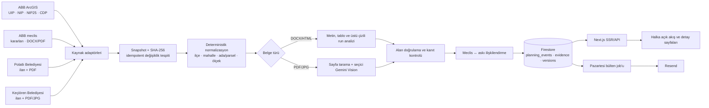
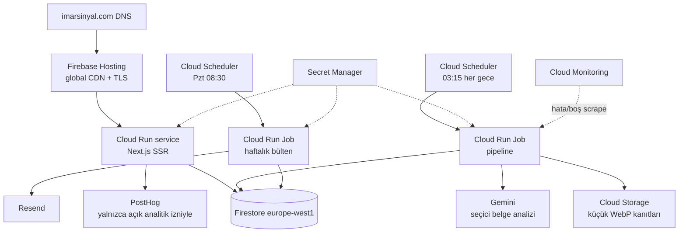

# İmarSinyal Ankara

ABB meclis kararlarını, büyükşehir askı katmanlarını ve ilçe belediyesi
ilanlarını otomatik izleyen; kaynak belgeli, filtrelenebilir planlama
değişikliği akışı.

Bu repository üç parçadan oluşur:

- `apps/web`: Next.js 15.5.21, TypeScript, SSR web ürünü ve HTTP API'leri
- `services/pipeline`: Python scraper, belge analizi, ilişkilendirme ve bülten
- `infra`: Firebase, Firestore, Cloud Run, Scheduler ve izleme yapılandırması

İlk sürümde hesap, ödeme, kişisel takip listesi ve harita yoktur. Yerelde
korunan 11 doğrulanmış fixture ile ürün hemen açılır; bulutta veri Firestore'dan
okunur.

## Çalışan ürün

Sayfalar:

- `/`: ürün anlatımı, öne çıkan olaylar ve bülten formu
- `/degisiklikler`: ilçe, aşama, kategori, metin ve etki filtresi
- `/degisiklik/[slug]`: eski/yeni alanlar, süreç, kanıt ve resmî belgeler
- `/bulten`: açık rıza ve en fazla üç ilçe tercihi
- `/gizlilik`, `/kullanim-kosullari`

API:

- `GET /api/events`
- `GET /api/events/{slug}`
- `POST /api/subscribers`
- `GET|POST /api/unsubscribe`
- `GET /api/healthz` (canlı Cloud Run/Firebase sağlık kontrolü)
- `GET /healthz` (yerel uygulama rotası; Google Frontend bu yolu rezerve eder)
- `GET /healthz.json` (Firebase edge sağlık kontrolü)

Tarayıcı Firestore'a doğrudan erişmez. Okuma ve yazma Next.js sunucusu
üzerindendir; Firestore güvenlik kuralları istemci erişimini kapatır.

Tarih alanları tarayıcı dilinden bağımsız Türkçe takvim kullanır. İsteğe bağlı
PostHog entegrasyonu varsayılan olarak kapalıdır; kullanıcı analitik izni
vermeden olay göndermez, oturum kaydı ve form içeriği toplamaz.

## Bugünkü aşama

Ürün **özel beta / yumuşak lansman hazırlığı** aşamasındadır. Altyapı ve halka
açık ürün dilimleri tamamlanmış, gerçek kullanıcı edinimi henüz
başlatılmamıştır.

| İlk 12 haftalık plan | Durum | Açıklama |
|---|---|---|
| Hafta 1 — temel ve landing | Tamamlandı | Next.js, Firestore, Cloud Run ve bülten formu canlı |
| Hafta 2 — ABB meclis scraper | Tamamlandı | 1 Ocak 2026 backfill ve idempotent snapshot akışı var |
| Hafta 3 — halka açık olay sayfaları | Tamamlandı | Akış, filtre, detay, kaynak ve SEO rotaları canlı |
| Hafta 4 — sınıflandırma ve etki | Tamamlandı | Deterministik kategori/etki ve kanıt korumaları var |
| Hafta 5 — harita | Bilinçli ertelendi | MVP kapsamı dışında |
| Hafta 6 — hesap/takip listesi | Bilinçli ertelendi | MVP kapsamı dışında |
| Hafta 7 — e-posta | Kısmen tamamlandı | Test bülteni ve zamanlayıcı hazır; gerçek gönderim domain doğrulamasını bekliyor |
| Hafta 8 — ödeme | Başlamadı | Kullanım sinyali görülmeden açılmayacak |
| Hafta 9 — bülten lansmanı | Hazır, yayın bekliyor | Pazartesi 08:30 job'u kurulu |
| Hafta 10 — doğrudan erişim | Başlamadı | Domain ve ilk kaynak kalite kontrolünden sonra |
| Hafta 11 — ücretli dönüşüm | Başlamadı | En erken kullanım davranışı oluştuktan sonra |
| Hafta 12 — go/no-go | Başlamadı | Abone, geri dönüş ve talep metrikleriyle yapılacak |

Kronolojik olarak “7. haftadayız” demek yanıltıcı olur: 5 ve 6. haftalar MVP
kararıyla ertelendi, 7 ve 9. haftanın altyapısı öne alındı. Doğru ürün tanımı
**Hafta 4 tamamlandı + lansman kapısı bekleniyor** şeklindedir.

## Sistem akışı

### Veri ve yayın hattı



### Bulut mimarisi



- UIP, NIP, NIP25, CDP, Polatlı ve Keçiören kaynakları bağımsız çekilir; bir
  kaynağın hatası diğerlerini durdurmaz.
- Geometri WGS84 olarak alınır; bbox ve centroid saklanır.
- Yeni, değişmiş, aynı kalan ve kaynaktan düşen snapshot'lar ayrılır.
- Meclis kararları 1 Ocak 2026'ya kadar geriye doldurulabilir.
- Polatlı ilan metni ve bağlı PDF; Keçiören ilan metni ve bağlı PDF/JPG birlikte
  saklanır. İlçe kaynağında varsayılan başlangıç kesimi 1 Ocak 2026'dır.
- DOCX metni, tabloları ve üstü çizili run'ları deterministik okunur.
- PDF'nin tüm sayfaları ucuz metin/çizim taramasından geçer; en ilgili en fazla
  12 sayfa Vision'a gider.
- Varsayılan model `gemini-3.5-flash-lite`, belirsizlik/hata durumunda
  `gemini-3.6-flash` kullanılır. `temperature` gönderilmez.
- Emsal, TAKS, Yençok ve kişi/ha yoğunluğu ayrı alanlardır.
- Kaynaktaki kanıta bağlanamayan eski/yeni değer temizlenir ve yayımlanmaz.
- Meclis ve askı olayları ilçe, parsel, ölçek ve tarih yakınlığıyla bağlanır.
  Düşük güvenli adaylar birleştirilmez.
- Kaynak PDF'lerin tamamı Storage'a kopyalanmaz; URL, hash ve küçük WebP kanıt
  önizlemeleri saklanır.

## Yerel kurulum

Gereksinimler: Node.js 22+, pnpm ve Python 3.11+.

```bash
pnpm install
python3 -m venv .venv
source .venv/bin/activate
pip install -r services/pipeline/requirements.txt
```

Web:

```bash
pnpm dev
```

`http://localhost:3000` adresi Firestore değişkeni yokken 11 fixture olayıyla
açılır.

Pipeline:

```bash
cp services/pipeline/.env.example services/pipeline/.env
PYTHONPATH=services/pipeline python -m imarsinyal.cli nightly
```

Yerel varsayılan veri deposu `data/imarsinyal-local.db` SQLite dosyasıdır.
Gemini anahtarı boşsa kaynak kayıtları yine işlenir fakat eski/yeni alanları
`source_only` olarak boş bırakılır.

Testler:

```bash
pnpm test
pnpm lint
pnpm build
PYTHONPATH=services/pipeline python -m unittest discover -s services/pipeline/tests -v
bash -n infra/bootstrap-cloud.sh infra/configure-schedulers.sh infra/configure-alerts.sh
```

Regresyon paketi özellikle şunları kilitler:

- Yuva `121–250 kişi/ha` emsal değildir.
- Korkutreis `TAKS 0.60` emsal değildir.
- Beytepe UIP/NIP ayrı kayıt kalır ve ilişkilenir.
- Tek ArcGIS katman hatası diğer katmanları durdurmaz.
- Aynı snapshot ikinci çalışmada yeni yazım üretmez.

26 Temmuz 2026 canlı doğrulamasında UIP 1, NIP 5, NIP25 0, Polatlı 4,
Keçiören 6 ve 2026 kesimine uyan 51 meclis kaydı birlikte işlendi. Toplam 67
kaynak kaydının 10'u yeni snapshot olarak 10 ürüne dönüştü; başarısız kayıt
olmadı. CDP servis hatası izole edildi ve diğer kaynakları durdurmadı. Aynı
snapshot'ın ikinci çalışmasında `changed_snapshots=0`,
`unchanged_snapshots=67` elde edilerek idempotency canlıda doğrulandı.
Geçmiş veri kalite bakımında 197 olayın parsel alanı, 59 olayın aynı
eski/yeni metrikleri ve etki puanı sürümlü olarak düzeltildi; iki bakım
komutunun da ikinci geçişi sıfır değişiklik üretti.

Eski kayıtların parsel alanlarını yeni deterministik kurallarla kontrol etmek
için bakım komutu önce salt-okunur çalıştırılır, örnekler incelendikten sonra
`--apply` ile yazılır. Yazılan her düzeltme `change_versions` koleksiyonunda
sürümlenir:

```bash
PYTHONPATH=services/pipeline python -m imarsinyal.cli repair-parcels
PYTHONPATH=services/pipeline python -m imarsinyal.cli repair-parcels --apply
PYTHONPATH=services/pipeline python -m imarsinyal.cli repair-metrics
PYTHONPATH=services/pipeline python -m imarsinyal.cli repair-metrics --apply
```

## Firebase ve Google Cloud kurulumu

Bu adımlar proje sahibi tarafından bir kez yapılır.

1. Yeni ve boş bir Firebase projesi oluşturun.
2. Blaze planını ve faturalandırma hesabını bağlayın.
3. Firestore'u geri değiştirilemeyen bölge olarak `europe-west1` seçerek
   oluşturun.
4. Cloud Billing'de 100 TL, 250 TL ve 500 TL bütçe uyarıları kurun. Uyarılar
   harcamayı otomatik durdurmaz.
5. Yerelde oturum açın:

```bash
gcloud auth login
gcloud auth application-default login
gcloud config set project FIREBASE_PROJECT_ID
```

6. Repository'deki `.firebaserc` dosyası `imar-sinyal` projesine bağlıdır.
7. API, Artifact Registry, bucket, service account ve Secret Manager
   kaynaklarını hazırlayın:

```bash
./infra/bootstrap-cloud.sh FIREBASE_PROJECT_ID
```

8. Secret değerlerini terminal geçmişine yazmadan ekleyin. Her komut girdiyi
   bekler; değeri yapıştırıp `Ctrl-D` ile tamamlayın:

```bash
gcloud secrets versions add gemini-api-key --data-file=-
gcloud secrets versions add resend-api-key --data-file=-
gcloud secrets versions add unsubscribe-secret --data-file=-
```

`unsubscribe-secret` için en az 32 rastgele byte kullanın. Anahtarları Git'e,
issue'ya veya mesaja koymayın.

Resend'de `İmarSinyal Bülteni` adlı bir Segment oluşturup kimliğini not edin.
Bu kimlik gizli anahtar değildir; web build'indeki `_RESEND_SEGMENT_ID`
değeridir. Kayıt olan kişi global kişi listesine eklenir ve bu segmente
iliştirilir.

9. Web image'ını oluşturup Cloud Run'a dağıtın. Resend API anahtarı henüz
   eklenmemişse site ve abonelik kaydı yine çalışır; Resend kişi eşitlemesi
   anahtar etkinleştirildikten sonra başlar:

```bash
gcloud builds submit \
  --config cloudbuild.web.yaml \
  --substitutions=_CONTACT_EMAIL=GERCEK_ILETISIM_EPOSTASI,_DATA_CONTROLLER_NAME=VERI_SORUMLUSU_ADI,_TEST_RECIPIENT=RESEND_HESAP_EPOSTASI,_RESEND_SEGMENT_ID=RESEND_SEGMENT_ID
```

10. Gece pipeline job'ını dağıtın:

```bash
gcloud builds submit --config cloudbuild.pipeline.yaml
```

11. Gece zamanlayıcısını kurun:

```bash
./infra/configure-schedulers.sh FIREBASE_PROJECT_ID
```

- Gece taraması: her gün `03:15 Europe/Istanbul`

12. Firestore kuralları, indexler ve Hosting yönlendirmesini dağıtın:

```bash
pnpm dlx firebase-tools deploy --only firestore,hosting
```

13. İlk backfill'i bir kez çalıştırın:

```bash
gcloud run jobs execute imarsinyal-nightly \
  --region=europe-west1 \
  --args=backfill,--from-date,2026-01-01 \
  --wait
```

Cloud Run web servisi `min-instances=0`, `max-instances=2` olarak; gece job'ı
tek task, 2 vCPU, 2 GiB, 60 dakika ve bir retry ile yapılandırılmıştır.

## Bülten güvenlik anahtarı

Resend API anahtarı Secret Manager'a eklendikten sonra web servisinde kişi
eşitlemesini açın:

```bash
gcloud run services update imarsinyal-web \
  --region=europe-west1 \
  --update-secrets=RESEND_API_KEY=resend-api-key:latest
```

Ardından test bülteni job'ını ve haftalık scheduler'ı dağıtın:

```bash
gcloud builds submit \
  --config cloudbuild.newsletter.yaml \
  --substitutions=_SITE_URL=https://FIREBASE_PROJECT_ID.web.app,_TEST_RECIPIENT=RESEND_HESAP_EPOSTASI

./infra/configure-schedulers.sh FIREBASE_PROJECT_ID true
```

Varsayılan dağıtımda `NEWSLETTER_PUBLIC_SENDS=false` kalır. Kayıt olan gerçek
kişiye e-posta gönderilmez; yalnızca `_TEST_RECIPIENT` olarak verilen Resend
hesap e-postasına test gönderilir.

Alan adı Resend'de doğrulandıktan ve gizlilik/iletişim bilgileri
tamamlandıktan sonra iki Cloud Run ortamında:

```text
NEWSLETTER_PUBLIC_SENDS=true
NEWSLETTER_FROM=İmarSinyal Ankara <bulten@alanadiniz.com>
```

değerleri açılır.

## Ürün analitiği

PostHog kurulumu isteğe bağlıdır. Project settings sayfasındaki `phc_` ile
başlayan public project token Cloud Run'da
`NEXT_PUBLIC_POSTHOG_PROJECT_TOKEN` olarak tanımlandığında izin paneli
görünür. Bu token gizli bir yönetim anahtarı değildir. Varsayılan host ABD
PostHog Cloud için
`https://us.i.posthog.com` değeridir.

İlk aşamada yalnızca şu değer sinyalleri ölçülür:

- sayfa görüntüleme
- değişiklik filtresi kullanımı
- detay/kaynak belge açma
- bülten kaydının tamamlanması

E-posta, form içeriği ve session replay PostHog'a gönderilmez. Abonelik API'si
sunucudan analitik olayı üretmez; yalnızca izin verilmiş tarayıcı istemcisi
ölçüm yapar. Kullanıcı iznini altbilgideki **Analitik tercihleri** düğmesinden
değiştirebilir.

## Alan adı ve DNS geçişi

Firebase Hosting tarafında `imarsinyal.com` ana domaini ve
`www.imarsinyal.com → imarsinyal.com` kalıcı yönlendirmesi oluşturulmuştur.
Natro DNS'te şu değişiklikler yapılmalıdır:

| İşlem | Tür | Ad/host | Değer |
|---|---|---|---|
| Sil | A | `@` | `85.159.66.93` |
| Ekle | A | `@` | `199.36.158.100` |
| Ekle | TXT | `@` | `hosting-site=imar-sinyal` |
| Sil | CNAME | `www` | `redirect.natrocdn.com` |
| Ekle | CNAME | `www` | `imar-sinyal.web.app` |

Natro e-posta hizmetinin mevcut SPF TXT kaydı silinmemelidir. DNS yayıldıktan
sonra Firebase alan sahipliğini doğrular, TLS sertifikasını üretir ve `www`
trafiğini ana domaine yönlendirir.

Resend hesabındaki ücretsiz plan bugün tek domain hakkını başka bir domain için
kullandığından `imarsinyal.com` ekleme isteği reddedilmektedir. Mevcut domain
silinmeden şu iki güvenli seçenekten biri seçilmelidir:

1. Resend planını birden fazla domain destekleyen seviyeye yükseltmek.
2. İmarSinyal için ayrı bir Resend hesabı/API anahtarı kullanmak.

Resend doğrulaması tamamlanana kadar `NEWSLETTER_PUBLIC_SENDS=false` kalır;
gerçek abonelere gönderim yapılmaz.

## İzleme

Pipeline üç ardışık boş askı sonucu gördüğünde
`THREE_CONSECUTIVE_EMPTY_SCRAPES` logunu üretir. Bootstrap script'i bunun için
`imarsinyal_empty_scrape_streak` log metriğini oluşturur.

Google Cloud Console'da Monitoring → Alerting altında iki e-posta politikası
oluşturun veya e-posta notification channel kimliğini kopyalayıp çalıştırın:

```bash
./infra/configure-alerts.sh FIREBASE_PROJECT_ID NOTIFICATION_CHANNEL_ID
```

Oluşturulan iki politika:

1. Cloud Run Job `imarsinyal-nightly` execution failure sayısı `> 0`
2. `logging.googleapis.com/user/imarsinyal_empty_scrape_streak` metriği `> 0`

Bildirim e-postası repository'ye yazılmaz; proje sahibinin Monitoring
notification channel'ı olarak eklenir.

## Şimdilik yapılmayacaklar

- Ücretli reklam
- Kullanıcı hesabı, ödeme ve Pro paket
- Harita ve kişisel alarm
- WhatsApp/SMS
- Tüm Türkiye'ye açılma

Önce en az 20 gerçek olay sayfası, ilk bülten ve davranış sinyalleri
tamamlanmalıdır.

## Veri ve sorumluluk

Veri ABB'nin kamuya açık sistemlerinden gelir. İmarSinyal bağımsız bir veri
ürünüdür; belediye hizmeti, resmî imar belgesi veya yatırım tavsiyesi değildir.
